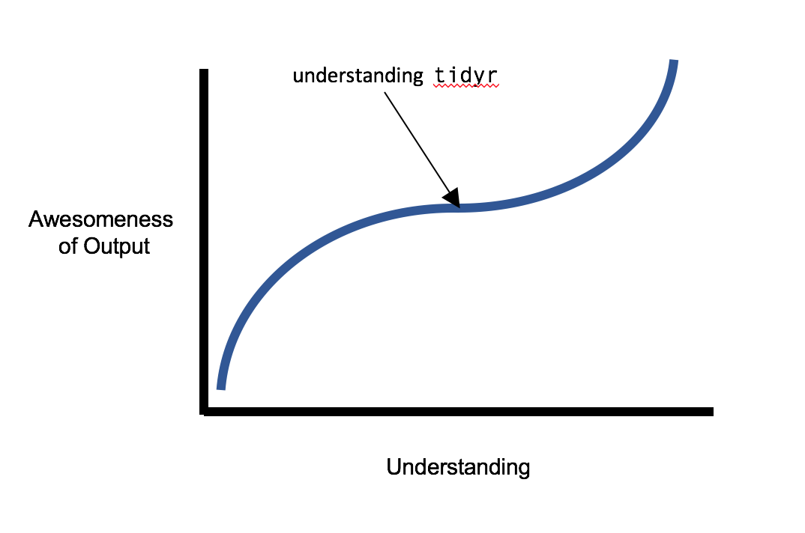

## Agenda

- Introducing the Tidyverse
- Introducing the Grammar of Graphics (`ggplot2`)
- Going Wider and Deeper


## Introducing the Tidyverse {.smaller}

- Data preparation consumes 80% of your time, so wouldn't it be nice if there were an <i>intuitive and idiomatic</i> way of wrangling data?

- Hadley Wickham, a computer scientist and statistician, invented the "tidy" approach to data handling with this aim and created a suite of libraries for R to implement it --- now known as the "tidyverse"  (or jokingly, the "Hadleyverse").  Here's Hadley:

<center></center>


## More motivation

- The "tidyverse" has become the industry-standard in the R-using data science community.

- There is an analogy in Python to the `numpy` and `pandas` suite.

- If you've tried to learn and use `dplyr`, `tidyr`, `ggplot2`, or other Tidyverse affiliates, in the past and became frustrated ... I have been in your shoes and this tutorial is especially for you.


## Introducing the Grammar of Graphics

- Leland Wilkinson extended this unified, idiomatic approach to data <i>visualization</i> with his book "The Grammar of Graphics."

- A grammar is a set of guidelines for how to combine components to create new things.  For example, we combine a noun and verb to make a sentence: "the dog runs".  Or you combine butter, eggs, sugar and flour to make a cupcake.

<center></center>


## `ggplot`

- In visualization, we will speak of combining:

  1. `data`.  Our base ingredient, usually a `data.frame` or `tibble`.
  
  2. `aes`thetic mapping.  The map of the data to the visualization; for example, "price on the x-axis".
  
  3. `geom`etry.  The shapes of the visualization: point, line, bar, ...
  
  4. `stat`istical transformation.  How should the data be transformed or aggregated before visualizing.
  
  5. `theme`.  Flavoring.
  
## Going Wider and Deeper with `tidyr`

<center></center>
  
## Understanding the Philosophy

The unifying philosophy of "tidy data" is:	

- Each row is an observation
- Each column is a variable
- Each table is an observational unit

Simple, right?  Yet a lot of data isn't formed that way.  


## {.smaller}

Consider the following table:	

<div class='white'>
asdf 
</div>

|Company  | Qtr.1  |  Qtr.2  |  Qtr.3  |  Qtr.4  |	
|---------|--------|---------|---------|---------|	
|ABC      |$134.01 |$256.77  |$1788.23 |$444.37  |	
|XYZ      |$2727.11|$567.23  |$321.01  |$4578.99 |	
|GGG      |$34.31  |$459.01  |$123.81  |$5767.01 |	

<div class='white'>
asdf 
</div>
 	
This looks completely acceptable, and is a compact way of representing the information.  However, if we are treating "quarterly earnings" as the observed value, then this format doesn't really follow the tidy philosophy: notice that there are multiple prices (observations) on a row, and there seems to redundancy in the column headers... 	


## {.smaller .vcenter}
 	
In the tidyverse, we'd rather have the table represent "quarterly earning," with each row giving a single observation of a single quarter for a single company, and columns representing the company, quarter, and earning.  Something like this:

<div class='white'>
asdf 
</div>

|Company  | Quarter |  Earnings  |	
|---------|---------|------------|	
|ABC      |Qtr.1    |$134.01     |	
|ABC      |Qtr.2    |$256.77     |	
|ABC      |Qtr.3    |$1788.23    |	
|...      |...      |...         |  

<div class='white'>
asdf 
</div> 
 	
This is also called the <b>wide</b> vs. the <b>long</b> format, and we will soon see why it is such a crucial point.


## Gather and Spread

Here's the quarterly earnings table again as a `data.frame` named `earnings`:

```{r echo=FALSE, message=FALSE}
library(tidyr)
library(dplyr)
```
```{r echo=FALSE}
earnings = data.frame(Company=c('ABC', 'XYZ', 'GGG'),
                      Qtr.1=c(134, 2727, 34),
                      Qtr.2=c(256, 567, 459),
                      Qtr.3=c(1788, 321, 123),
                      Qtr.4=c(444, 4578, 5767))
```
```{r}
earnings
```

## Gather

Now we `gather` it up into a <b>long</b> format by setting our new "key" column (Quarter), our new "value" column (Earnings), and specifying where to get that information from in the original table (everywhere but the Company column):

```{r}
long.earnings = earnings %>% 
  gather(key=Quarter, value=Earnings, -Company)

long.earnings %>% head()  # take a peek
```


## Spread

We can take a long format and `spread` it back out into <b>wide</b> format by specifying again the "key" column and the "value" column:

```{r}
long.earnings %>% spread(key=Quarter, value=Earnings)
```


## Wrapping Up